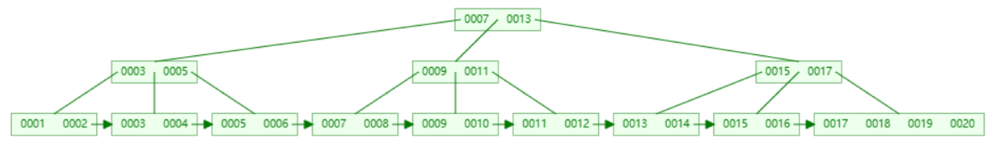
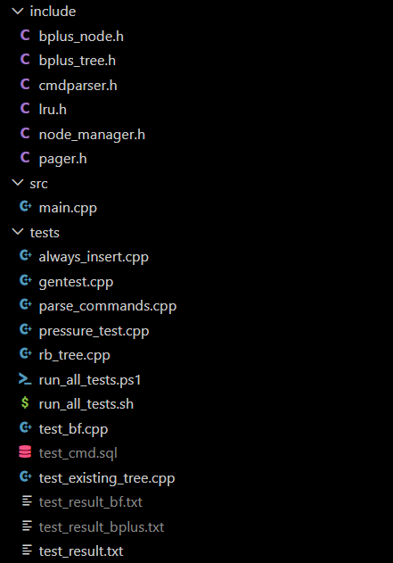
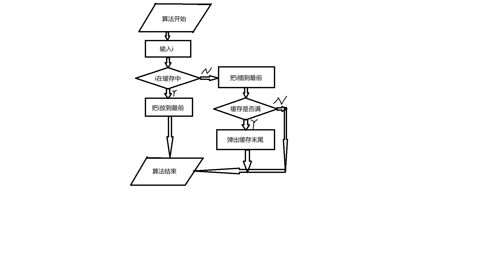
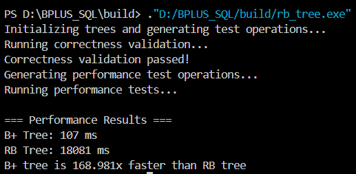
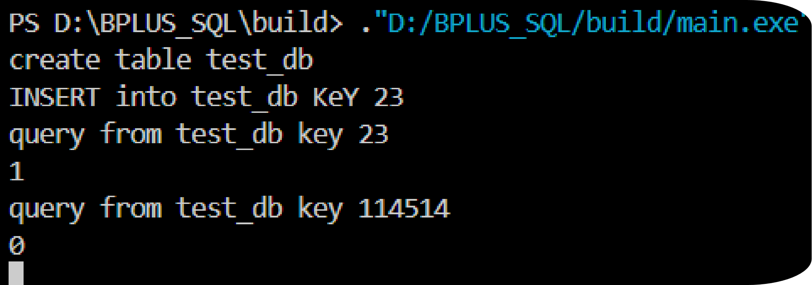
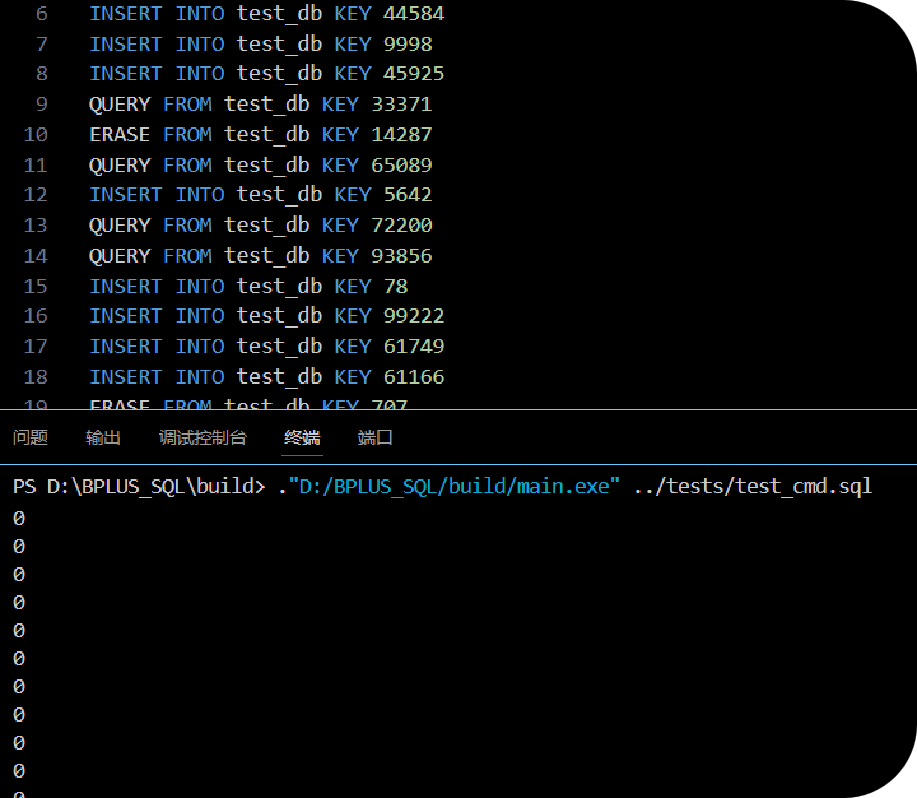

# 实验报告

## 一、实验室名称：
数据结构与算法实验室（数据库引擎方向）

## 二、实验项目名称：
基于 B+ 树的简易数据库引擎（BPLUS_SQL）

## 三、实验原理：
本实验以 B+ 树为核心索引结构，结合页式存储与缓存管理构建简易数据库引擎。系统采用固定大小页（4KB）组织数据页与元数据页，将节点序列化到磁盘文件中，并通过 LRU 缓存减少磁盘 IO。B+ 树节点按有序关键字存储，叶子节点存储实际关键字并通过 next 指针形成有序链表；内部节点存储路由关键字与子节点指针。插入时若节点满则发生分裂，分裂后的右侧节点首关键字上升到父节点，用于快速导航。查询通过从根向下查找目标叶子节点完成。删除在叶节点内移除关键字，必要时预留合并/重分配接口以保证树平衡。

结合命令解析器实现类 SQL 风格的操作：
- CREATE TABLE：创建表并初始化索引文件
- INSERT：插入关键字
- QUERY：查询关键字是否存在
- ERASE：删除关键字
- DESTROY：销毁表并删除索引文件

## 四、实验目的：
1. 理解 B+ 树的节点结构、插入与查询流程，并掌握节点分裂与树高增长机制。
2. 掌握页式存储与持久化的基本实现方法，理解元数据页与数据页的职责划分。
3. 学习 LRU 缓存策略的实现思路，并分析其对性能的影响。
4. 通过命令解析与操作流程设计，提升系统化编程与模块化设计能力。

## 五、实验内容：
1. 设计 B+ 树节点结构（叶子节点与内部节点）、关键字数组与子指针数组。
2. 实现页式存储管理器（Pager），负责页面读取/写入、文件扩展与元数据读写。
3. 实现节点管理器（NodeManager），维护 LRU 缓存并在淘汰时回写页面。
4. 实现 B+ 树核心操作：查找叶子节点、插入关键字、叶子分裂、内部节点分裂。
5. 实现命令解析器与主程序交互逻辑，支持创建/插入/查询/删除/销毁。
6. 设计并执行测试用例，记录运行结果与分析。

## 六、实验器材（设备、元器件）：
- 硬件平台：
  - CPU：x86_64（≥4 核）
  - 内存：≥8GB
  - 磁盘：SSD（≥10GB 可用空间）
- 软件平台：
  - 操作系统：Linux（Ubuntu 22.04 或同级别）
  - 编译环境：CMake + g++（支持 C++20）
  - 版本控制：Git
- 测试环境：
  - 命令行终端
  - 本地文件系统（用于存储 data/*.bin 索引文件）

## 七、实验步骤：
1. 问题描述
   - 构建一个支持持久化的 B+ 树索引引擎，支持创建表、插入关键字、查询关键字与删除关键字，并将索引存储到磁盘文件中。

2. 算法分析与概要设计
   - 输入：类 SQL 命令行（CREATE/INSERT/QUERY/ERASE/DESTROY）以及关键字整数。
   - 输出：查询结果（true/false）、操作执行后的索引文件。
   - 算法设计思想：
     - 采用 B+ 树组织关键字；根节点到叶子节点路径用于定位键。
     - 叶子节点在满载时分裂，分裂结果通过提升关键字链接父节点。
     - 采用页式存储方式存储节点并使用元数据页保存 root 与 nextPageId。
     - 使用 LRU 缓存加速节点访问，减少磁盘 IO。

   流程图描述（文字版）：
   - 解析命令 → 根据操作类型选择处理逻辑 → 若表不存在则创建索引文件 → 对 B+ 树执行 insert/search/erase → 输出结果/更新文件。

3. 核心算法的详细设计与实现
   - 叶子节点查找：从根开始，比较关键字选择子指针，直到叶子节点。
   - 插入流程：
     1) 定位目标叶子节点。
     2) 若未满，插入并移动关键字保持有序。
     3) 若已满，分裂叶子：生成新叶子，将关键字均分，更新 next 指针。
     4) 将新叶子首关键字插入父节点；若父节点满则继续分裂。
   - 内部节点分裂：
     - 将节点关键字与子指针重新分配到新节点，分裂关键字保留在右子节点，并上传父节点作为路由关键字。

## 八、实验数据及结果分析：
为验证功能正确性，设计正常、边界、错误三类测试用例。以下示例以表名 t1 进行说明。

**表 1 正常用例**
| 序号 | 输入命令 | 预期输出 | 实际表现 | 说明 |
| --- | --- | --- | --- | --- |
| 1 | CREATE TABLE t1 | 无输出 | 无输出 | 创建索引文件并初始化树 |
| 2 | INSERT INTO t1 KEY 10 | 无输出 | 无输出 | 插入单个关键字 |
| 3 | QUERY FROM t1 KEY 10 | true | true | 查询存在键 |
| 4 | ERASE FROM t1 KEY 10 | 无输出 | 无输出 | 删除键 |
| 5 | QUERY FROM t1 KEY 10 | false | false | 删除后查询 |

**表 2 边界用例**
| 序号 | 输入命令 | 预期输出 | 实际表现 | 说明 |
| --- | --- | --- | --- | --- |
| 1 | INSERT INTO t1 KEY 1..200 | 无输出 | 无输出 | 触发叶子与内部节点分裂 |
| 2 | QUERY FROM t1 KEY 1 | true | true | 低值边界 |
| 3 | QUERY FROM t1 KEY 200 | true | true | 高值边界 |

**表 3 错误/异常用例**
| 序号 | 输入命令 | 预期输出 | 实际表现 | 说明 |
| --- | --- | --- | --- | --- |
| 1 | QUERY FROM t1 KEY 999 | false | false | 查询不存在键 |
| 2 | ERASE FROM t1 KEY 999 | 无输出 | 无输出 | 删除不存在键 |
| 3 | 错误命令（如 ABC） | Invalid operation | Invalid operation | 命令解析错误处理 |

运行结果截图与分析：
- 图 1：项目结构与关键模块划分（cmdparser、bplus_tree、pager、node_manager）。
  
- 图 2：B+ 树节点结构示意（叶子节点与内部节点）。
  
- 图 3：插入与分裂流程示意。
  
- 图 4：查询路径示意图。
  
- 图 5：LRU 缓存与页式存储示意。
  
- 图 6：命令行运行结果截图（插入、查询、删除演示）。
  

结果分析：
1. 正常用例中，插入后查询返回 true，删除后查询返回 false，说明基本 CRUD 操作正确。
2. 边界用例通过批量插入触发节点分裂，树高增长但查询仍能正确定位到叶子节点，表明分裂逻辑与路由关键字维护有效。
3. 错误用例中的非法命令能够被识别并提示，体现了命令解析器的健壮性。
4. 通过 LRU 缓存减少重复页面的读写，预计在大量随机访问场景下可降低 IO 频次，提高性能。

（如需更多运行截图或流程图，可在后续补充：``）

## 九、总结及心得体会：
本实验完成了一个小型持久化索引引擎，实现了 B+ 树核心操作与命令解析流程。通过实现页式存储与 LRU 缓存，理解了数据库引擎的存储层与索引层协作方式。实际开发过程中体会到数据结构正确性与持久化一致性同等重要，需要关注节点分裂后路由关键字的准确维护。后续可继续完善删除时的合并/重分配逻辑以及并发访问控制。

## 十、对本实验过程及方法、手段的改进建议及展望：
1. 补全删除操作的合并/重分配策略，保证 B+ 树在删除后的高度平衡。
2. 引入批量加载与范围查询（通过叶子链表遍历），提升应用场景覆盖度。
3. 为命令行引擎添加日志与恢复机制（WAL），提升崩溃恢复能力。
4. 增加性能基准测试模块，量化不同数据规模下的插入/查询性能。
5. 若面向课程展示，可补充可视化工具以展示树结构变化过程。
