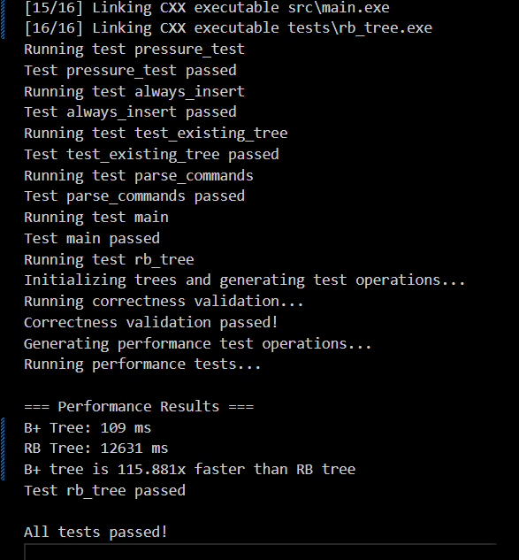

# 实验报告

## 一、实验室名称：
品学楼C222

## 二、实验项目名称：
基于 B+ 树的简易数据库引擎（BPLUS_SQL）

## 三、实验原理：
本实验以 B+ 树为核心索引结构，结合页式存储与缓存管理构建简易数据库引擎。系统采用固定大小页（4KB）组织数据页与元数据页，将节点序列化到磁盘文件中，并通过 LRU 缓存减少磁盘 IO。B+ 树节点按有序关键字存储，叶子节点存储实际关键字并通过 next 指针形成有序链表；内部节点存储路由关键字与子节点指针。插入时若节点满则发生分裂，分裂后的右侧节点首关键字上升到父节点，用于快速导航。查询通过从根向下查找目标叶子节点完成。删除在叶节点内移除关键字，必要时预留合并/重分配接口以保证树平衡。

结合命令解析器实现类 SQL 风格的操作：
- `CREATE TABLE`：创建表并初始化索引文件
- `INSERT`：插入关键字
- `QUERY`：查询关键字是否存在
- `ERASE`：删除关键字
- `DESTROY`：销毁表并删除索引文件

## 四、实验目的：
> 着重提对数据结构与算法相关的提升和目的，讲对写测试和验证代码正确性的能力，带过对工程能力和代码能力的提升

## 五、实验内容：
1. 设计 B+ 树节点结构（叶子节点与内部节点）、关键字数组与子指针数组。
2. 实现页式存储管理器（`Pager`），负责页面读取/写入、文件扩展与元数据读写。
3. 实现节点管理器（`NodeManager`），维护 LRU 缓存并在淘汰时回写页面。
4. 实现 B+ 树核心操作：查找叶子节点、插入关键字、叶子分裂、内部节点分裂。
5. 实现命令解析器与主程序交互逻辑，支持创建/插入/查询/删除/销毁。
6. 设计并执行测试用例，记录运行结果与分析。

## 六、实验器材（设备、元器件）：
- 硬件平台：
  - CPU：x86_64
  - 内存：32GB
  - 磁盘：SSD（100GB 可用空间）
- 软件平台：
  - 操作系统：Windows 11
  - 编译环境：CMake + MinGW g++15.2（支持 C++23）
  - 编辑器：VSCode
- 测试环境：
  - VSCode + CMake一键运行
  - 本地文件系统（用于存储 data/*.bin 索引文件）

## 七、实验步骤：
1. 问题描述
   - 构建一个支持持久化的 B+ 树索引引擎，支持创建表、插入关键字、查询关键字与删除关键字，并将索引存储到磁盘文件中。

2. 算法分析与概要设计
   - 输入：类 SQL 命令行（CREATE/INSERT/QUERY/ERASE/DESTROY）以及关键字整数。
   - 输出：查询结果（1/0）、操作执行后的索引文件（data/*.bin）。
   - 总体设计要点：
     - 算法核心：采用 B+ 树作为索引结构，叶子节点保存实际关键字并通过 `next` 指针形成有序链表，内部节点保存路由键用于快速定位子树。
     - 外存与页式存储：节点按固定大小页（4KB）序列化到磁盘文件，使用元数据页保存 `root` 与 `nextPageId`，避免全表加载到内存。
     - 缓存策略：在内存侧采用 LRU 缓存（`NodeManager` + `LRUCache`）以降低磁盘 IO，保证热数据高命中率。

   流程（高层）：
   - 解析命令 → 打开/创建索引文件 → 通过 `BPlusTree` 执行 insert/search/erase → 在 `NodeManager` 中通过 LRU 缓存访问节点，必要时由 `Pager` 读写磁盘页面 → 更新并持久化元数据。

3. 核心算法的详细设计与实现
   **B+ 树（算法核心）**

   - 设计理由：B+ 树是一种面向外存的平衡树，具有以下优势：
     - 节点扇出高（每个内部节点包含多个路由键），树高低，从根到叶子的 IO 次数少，适合磁盘访问场景；
     - 所有实际记录（或键）都在叶子节点，范围查询可以通过叶子链表顺序扫描高效实现；
     - 分裂（split）仅影响局部节点，且通过提升分裂后右侧节点首键到父节点实现路由更新，便于增量持久化。
   - 要点：
     - 查询：从 `root` 开始，使用内部节点的路由键选择子指针，直到叶子节点，在叶内二分或线性查找目标键；
     - 插入：定位叶子后插入；若叶满，分裂为左右两叶并调整 `next` 指针；将新叶首键上升到父节点，可能沿路径递归分裂，根分裂时高度加一。
     - 删除：

   代码示例（节点结构，节选自 include/bplus_node.h）：

```cpp
struct BPlusNode {
    bool isLeaf;
    int keyCount;
    int keys[128];
    size_t children[129];
    size_t next; // 叶子链表指针
};
```

   **外存读写：为什么使用 B+ 树**
   - 磁盘 IO 特性决定了索引需要尽量减少随机小 IO 次数：B+ 树通过较大扇出把树高压低，查询/插入访问磁盘页的次数为 $O(log_f N)$ （f 为扇出），通常远小于二叉树的 IO 次数；
   - 本工程采用页式存储（`Pager`），每个 B+ 节点被序列化为一页（4KB），读取节点即一次顺序的大块读写，能较好匹配操作系统与磁盘缓存的块大小，提高吞吐；
   - `Pager` 的读写示例（节选自 include/pager.h）：

```cpp
template<typename T>
void readPage(size_t pageId, T &node) {
    // offset = metadata page + pageId * PAGE_SIZE
    m_file.seekg(PAGE_SIZE + pageId * PAGE_SIZE, std::ios::beg);
    std::vector<char> pageBuf(PAGE_SIZE);
    m_file.read(pageBuf.data(), PAGE_SIZE);
    std::memcpy(&node, pageBuf.data(), sizeof(node));
}
template<typename T>
void writePage(size_t pageId, T &node) {
    std::vector<char> pageBuf(PAGE_SIZE, 0);
    std::memcpy(pageBuf.data(), &node, sizeof(node));
    m_file.seekp(PAGE_SIZE + pageId * PAGE_SIZE, std::ios::beg);
    m_file.write(pageBuf.data(), PAGE_SIZE);
}
```

   - 小结：B+ 树与页式存储的结合，能把每次逻辑节点访问转化为一次大块磁盘读写，显著降低随机小 IO 的开销。

   **LRU 缓存（性能提升与实现复杂度权衡）**

   - 目标：把热点页面尽量保存在内存中，减少 `Pager` 的读写次数，从而提升查询与插入吞吐。
   - 为什么选 LRU：LRU（最近最少使用）策略对局部性强的数据库负载（尤其读多或读写局部性）表现良好；实现简单、可预测，且不需要复杂的并发协议就能带来明显性能提升。

   代码示例（LRU 缓存核心，节选自 include/lru.h）：

```cpp
std::shared_ptr<BPlusNode> get(size_t pageId) {
    auto it = m_cache.find(pageId);
    if (it == m_cache.end()) return nullptr;
    m_list.erase(it->second.second);
    m_list.push_front(pageId);
    it->second.second = m_list.begin();
    return it->second.first;
}
void put(size_t pageId, std::shared_ptr<BPlusNode> node) {
    if (m_cache.size() >= CAPACITY) evictLRU();
    m_list.push_front(pageId);
    m_cache[pageId] = {node, m_list.begin()};
}
std::list<size_t> m_list;
std::unordered_map<size_t, std::pair<std::shared_ptr<BPlusNode>, std::list<size_t>::iterator>> m_cache;
```

   - 写回时机：`NodeManager` 在析构或淘汰时会遍历缓存并将节点写回磁盘，该策略保证了简单可靠的持久化路径。

## 八、实验数据及结果分析：
运行结果截图与分析：




> 从这些运行截图中可以看出，……

## 九、总结及心得体会：
本实验完成了一个小型持久化索引引擎，实现了 B+ 树核心操作与命令解析流程。通过实现页式存储与 LRU 缓存，理解了数据库引擎的存储层与索引层协作方式。实际开发过程中体会到数据结构正确性与持久化一致性同等重要，需要关注节点分裂后路由关键字的准确维护。后续可继续完善删除时的合并/重分配逻辑以及并发访问控制。

## 十、对本实验过程及方法、手段的改进建议及展望：
1. 补全删除操作的合并/重分配策略，保证 B+ 树在删除后的高度平衡。
2. 引入批量加载与范围查询（通过叶子链表遍历），提升应用场景覆盖度。
> 3. 使用并行算法
> 4. 实现更多的数据结构，如浮点数、字符串